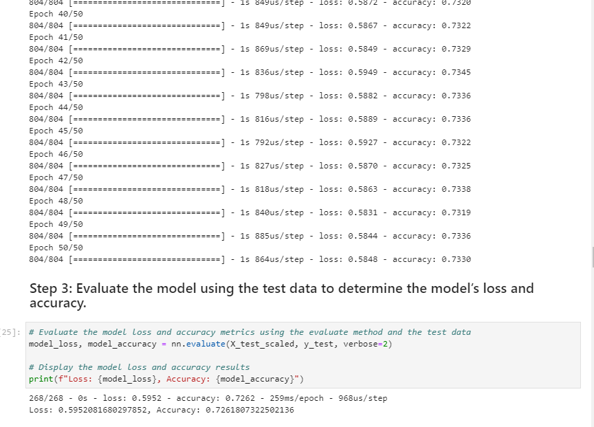
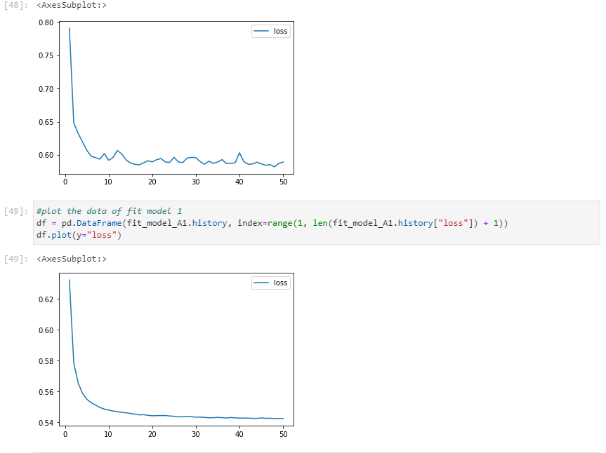

## Credit_risk_resampling
Using data from 34,000 potential startups to decide if they will be succesful using The neural network model with 3 different parameters, and then locally saving them for later use. 

---

## Technologies

Language: Python 3.9.12

Libraries used:

[Pandas](https://pandas.pydata.org/pandas-docs/stable/index.html) - For the creation and visualization of Data Frames

[Jupyter Labs](https://jupyter.org/) - An ipython kernel for interactive computing in python

[Matplot Lib](https://matplotlib.org/) - Library used for creating plots and visualizations

[Scikit-Learn](https://scikit-learn.org/0.18/auto_examples/svm/plot_iris.html) - Powerful machine learning library

[Tensor Flow](https://www.tensorflow.org/) - Machine learning platform for production ready applications

[Keras](https://keras.io/about/) - Built on-top of Tensor Flow, a powerful deep-learning API

---

## Usage

Open up your gitbash terminal and navigate to the location of the program files and activate your dev environment, after doing so open up jupyter labs by typing jupyter lab in gitbash. then run the model and observe the report. Every model takes a slightly different paramater to try and get the most accurate answer.

## Highlights
--- 
Determining model accuracy after 50 epochs.

---

---
Subplots of neural networks

---

## Contributors

Created by Austin Means while in the UW FinTech Bootcamp
> Contact Info:
> email: austinmeans92@gmail.com|
> 
> [GitHub] (https://github.com/aimeans) |